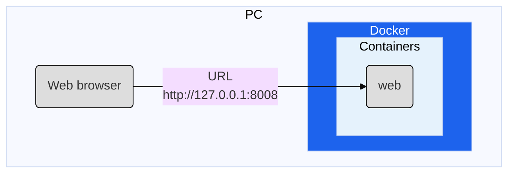
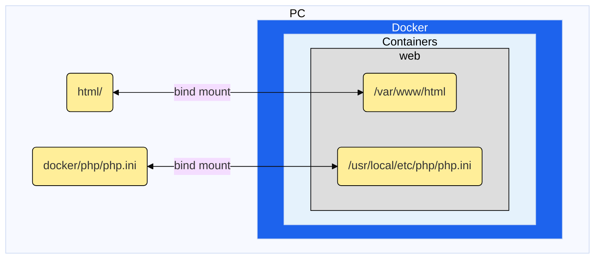

# シンプルなPHP開発環境

シンプルなPHP開発環境のGitHubテンプレートリポジトリです。  
データベースを含めていない、PHPのみの開発環境です。  

## 動作環境

- `Windows` or `macOS`
- `Docker Desktop`

## 環境イメージ



## 導入方法

ZIPをダウンロードするか、リポジトリを作成してクローンしてください。

- ZIPダウンロード方法
  - ソース コード アーカイブのダウンロード
    - <https://docs.github.com/ja/repositories/working-with-files/using-files/downloading-source-code-archives>
- リポジトリ作成方法
  - テンプレートからリポジトリを作成する
    - <https://docs.github.com/ja/repositories/creating-and-managing-repositories/creating-a-repository-from-a-template>
  - リポジトリをクローンする
    - <https://docs.github.com/ja/repositories/creating-and-managing-repositories/cloning-a-repository>

## 環境構築

### docker-compose

- `docker-compose.yml`があるディレクトリで、`docker-compose up -d` コマンドを実行してください。

```bash
# ターミナルで実行
## ls コマンドで docker-compose.yml があるか確認
ls docker-compose.yml
## docker-compose で環境構築  ※ 時間がかかるので注意
docker-compose up -d
```

### 確認

以下のURLにアクセスし、PHP画面が表示されるか確認してください。  
[html/index.php](./html/index.php)ファイルが実行され、ブラウザに表示されます。  

- <http://127.0.0.1:8080/index.php>

## 解説

### ドキュメントルート

ローカルの [html/](./html/) フォルダとコンテナ内のドキュメントルートのディレクトリの`/var/www/html`を[マウント](https://docs.docker.jp/compose/compose-file/compose-file-v3.html#compose-file-v3-volumes-short-syntax)しており、[html/](./html/) フォルダ内にファイルを配置すると`/var/www/html`内にもファイルが配置され、ブラウザからアクセスできるようになります。  
[php.ini](./docker/php/php.ini)ファイルも同様にマウントを行っているため  
ローカルの[php.ini](./docker/php/php.ini)ファイルを更新するとコンテナ内の`php.ini`ファイルも更新されます。


